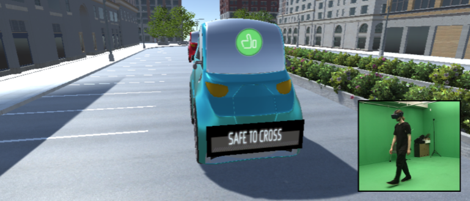
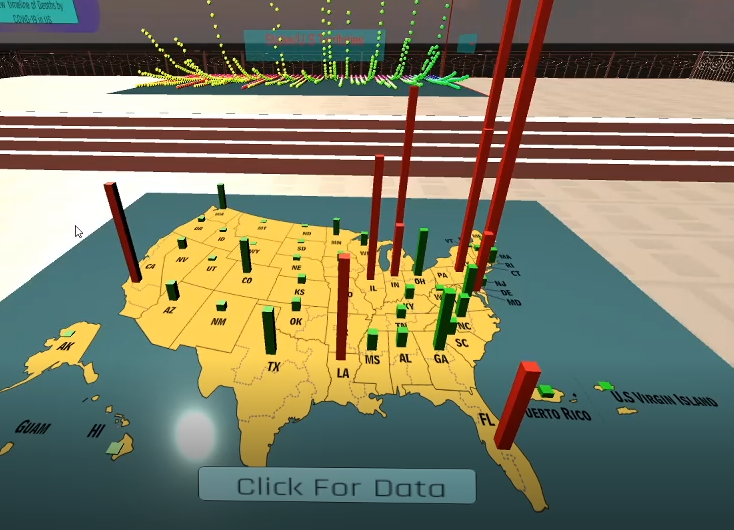
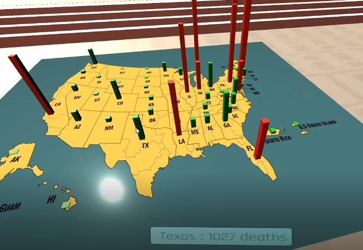
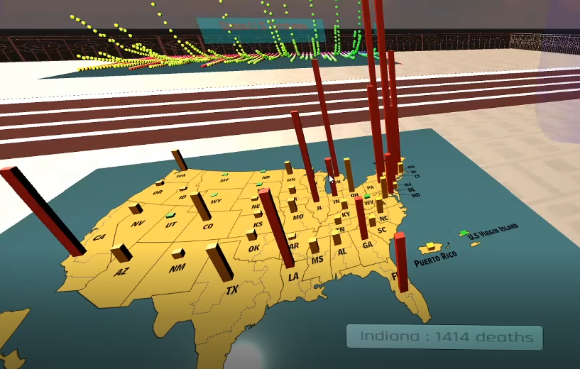
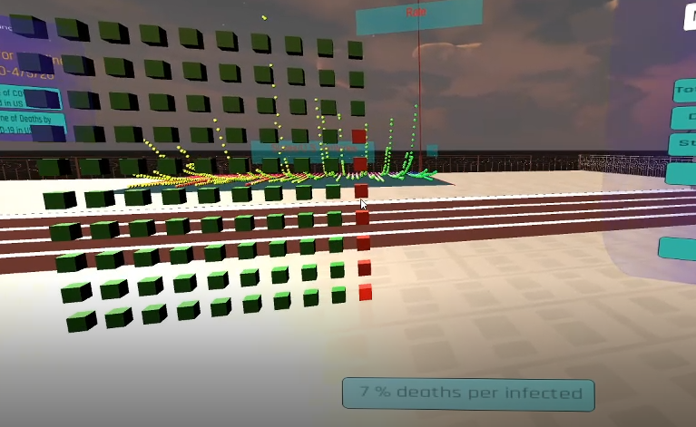

## Portfolio

<!--### Category Name 1 -->

#### [VR-PAVIB Simulation](https://github.com/anafdal/AV-Simulation)
 

***

#### [COVID-19 3D Data Visualization](https://github.com/anafdal/CGT515_DataVisualization)
 

***

#### [Interactive Bifurcation Graph](https://mcs.bw.edu/~adalipi15/Chaos_Theory_And_Technology_Paper.html)
- [Logistic Equation Graph](https://mcs.bw.edu/~adalipi15/135/bff.html)
- [Sine Logistic Equation Graph](https://mcs.bw.edu/~adalipi15/135/BFFTEST2.html)
- [Cosine Logistic Equation Graph](https://mcs.bw.edu/~adalipi15/135/BFFTEST3.html)

---
### Research Papers

- [VR-PAVIB: The Virtual Reality Pedestrian-Autonomous Vehicle Interactions Benchmark Suite (Current Project)](http://example.com/)
- [Chaos Theory and Technology (Baldwin Wallace University, 2019)](https://mcs.bw.edu/~adalipi15/Chaos_Theory_And_Technology_Paper.html)
- [Bio-Inspired Solar Electric Propulsion Investigation (NASA Glenn Research Center, 2018)](/pdf/2018%20Space%20Academy%20Final%20Report%20copy-converted.pdf)

   

---

Page template forked from <a href="https://github.com/evanca/quick-portfolio">evanca</a>

<!-- Remove above link if you don't want to attibute -->
